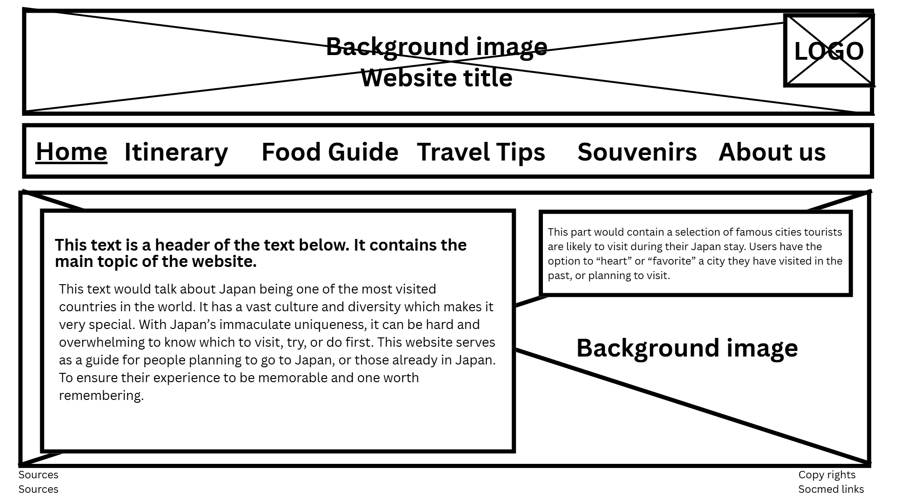
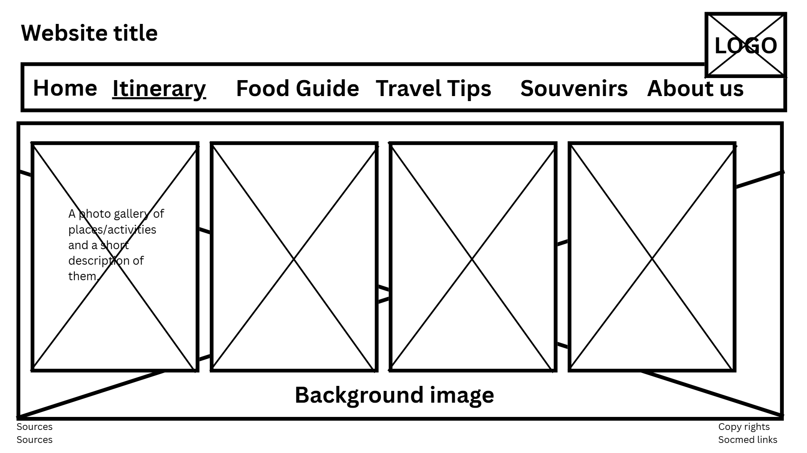
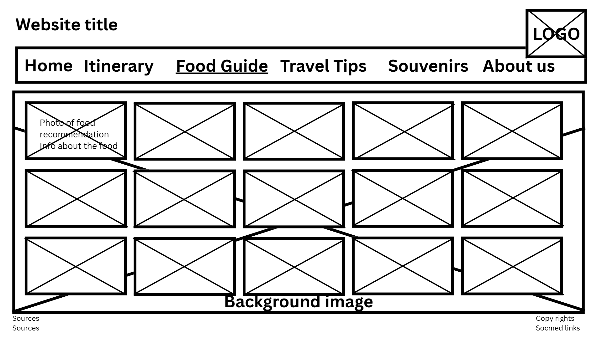
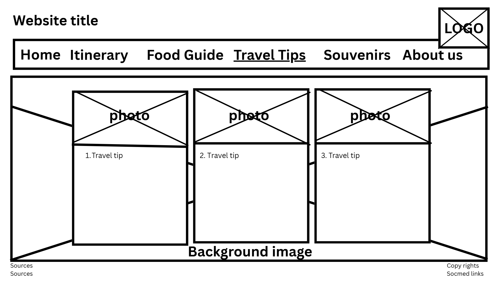
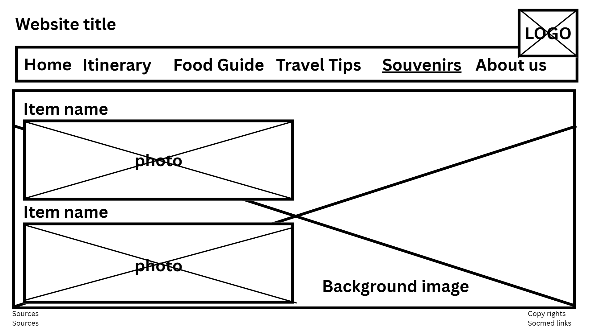
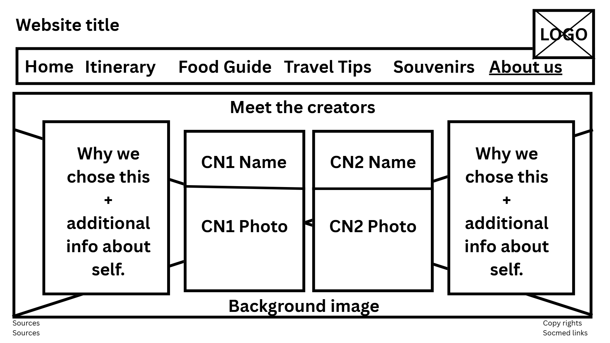

# JapanEase  
## A Beginner's Guide to Japan  

---
### Website Logo:

  

### Website Description  
JapanEase is a travel guide website designed to help visitors explore Japan with ease. It provides travelers with essential travel tips, itineraries, destination highlights, food recommendations, and more. Whether planning for an upcoming trip or revisiting the mesmerizing streets of Japan, this guide ensures a memorable journey across the Land of the Rising Sun.  

---

## Webpage Outline  

### Homepage  
- Overview of Japan and why it is one of the most visited countries in the world.  
- A short welcome paragraph addressed to the traveler or user.  
- A space where users can like/heart/favorite a specific city they will be visiting or they have visited in the past.  

---

### Itinerary  
- List of major spots or must-visit areas (e.g., Tokyo, Kyoto, Osaka, Hokkaido).  
- Activities to do in each area (e.g., temple visits, shopping, skiing, onsen baths).  
- Recommendations on the best time or day to visit each location.  
- Description of each destination’s unique features and cultural highlights.  

---

### Food Guide  
- List of must-try Japanese dishes (e.g., sushi, ramen, takoyaki, tempura).  
- Overview of Japanese dining etiquette to observe when eating in restaurants.  
- Recommendations of famous restaurants and street food stalls across Japan.  

---

### Travel  
- Essential reminders and dos and don’ts when visiting Japan.  
- Overview of transportation options (JR Pass, subway systems, taxis, etc.).  
- Budgeting and safety tips for travelers.  
- Basic and useful Japanese phrases for daily conversations.  

---

### Souvenirs  
- List of must-buy items found only in Japan (e.g., KitKats, stationery, skincare).  
- Recommended stores to visit, such as Don Quijote and local markets.  
- Suggestions for best pasalubongs to bring home for friends and family.  

---

### About Us  
- A short compilation of the authors' informations.  
- Would include a photo of the author and why we collectively agreed upon the chosen topic.  

## Description of JavaScript Incorporation  

JavaScript will be incorporated into the website to make it more interactive and engaging for users. Specifically, it will be used on the **Home Page** to enable a “favorite” or “heart” feature for cities and destinations displayed on the site.  

When users click the heart icon beside a city or tourist spot, JavaScript will record and visually update the icon (e.g., changing color to red) to indicate that it has been added to their favorites.  

### Additional JavaScript Features  
- Smooth transitions or animations within the photo gallery  
- Responsive navigation effects (nav area and various effects with buttons)  

Through JavaScript, **A Complete Traveler’s Guide to Japan** will offer a more interactive and user-friendly browsing experience that allows visitors to personalize their exploration of Japan’s destinations.  

## Wireframes of Project Proposal  

### Home Page  
  

### Itinerary Page 
  

### Food Guide Page 
  

### Travel Tips Page 
  

### Souvenirs Page 
  

### About Us Page
  

